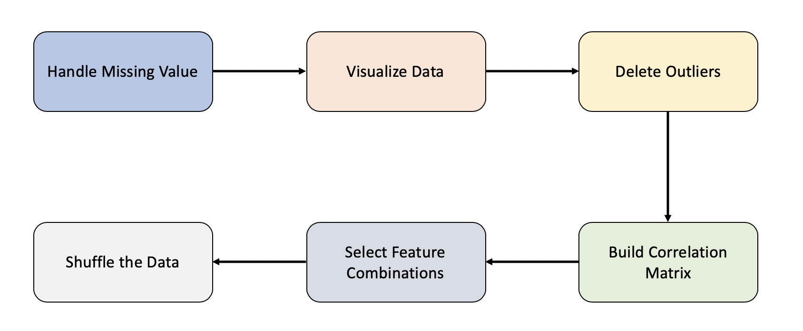

# < Pima Indians Diabetes Database-Predict the onset of diabetes based on diagnostic measures>

### Groups
* <蔡宗諺, 108753205>
* <葉冠宏, 108753208>
* <蔡承軒, 107354018>


### Goal

目標為預測該人是否為糖尿病患者

The objective of the dataset is to diagnostically predict whether or not a patient has diabetes.

### Demo 
Performance
```R
Rscript code/rproject.R --fold n --train data/diabetes.csv --report performance.csv --predict predict.csv
```
* any on-line visualization

## Folder organization and its related information

### docs
* Your presentation, 1082_datascience_FP_Group4.pdf, by **Jun. 25**
* Any related document for the final project
  * papers
  * software user guide


### data

* Source
  * https://www.kaggle.com/uciml/pima-indians-diabetes-database

* Input format：.csv

* Data Features
  * Pregnancies: Number of times pregnant
  * Glucose:  Plasma glucose concentration a 2 hours in an oral glucose tolerance test
  * BloodPressure:  Diastolic blood pressure (mm Hg)
  * SkinThickness:  Triceps skin fold thickness (mm)
  * Insulin:  2-Hour serum insulin (mu U/ml)
  * BMI:  Body mass index (weight in kg/(height in m)^2)
  * DiabetesPedigreeFunction: Diabetes pedigree function
  * Age:  Age (years)

* Any preprocessing?

  * Handle missing data
  * Visualize the data and find outliers
  * Delete outlier
  * Shuffle the data
  * Build Correlation matrix without missing value

  * Select different feature combinations
    * All Features
    * All Features without Insulin & DiabetesPedigreeFunction
    * All Features without Insulin & DiabetesPedigreeFunction & Pregnancies
    * All Features without Insulin & DiabetesPedigreeFunction & Age

### code

* Which method do you use?
  * Logistic Regression
  * Decison Tree
* What is a null model for comparison?
  * All output is 0 ,the model accuracy is 65%.
* How do your perform evaluation? ie. Cross-validation, or extra separated data
  * Split data into 3 part(Training/Validation/Testing)
  * K-fold cross validation

### results

* e.g. x1: Pregnancies x5:Insulin x7:DiabetesPedigreeFunction x8:Age


* Which metric do you use 
  * Accuracy
* Is your improvement significant?
  * As the result shows, if we put all features to train our model , no matter the logistic regression or decision tree, the training accuracy are the highest but the testing accuracy are lowest.
  * We thought that putting all features to train model would cause model be overfitted. Thus we took away the features that have high correlation to avoid the collinearity.
  * Eventually, we constructed a model which achieved 80% testing accuracy only trained with five features. The improvement is significantly higher than the null model.
  
* What is the challenge part of your project?
  * The challenge part of our project is that the data contains a lot of missing value. Moreover, our data have only 768 records so that we couldn't delete the data which contains missing value. 

## Reference
* Code/implementation which you include/reference (__You should indicate in your presentation if you use code for others. Otherwise, cheating will result in 0 score for final project.__)
* Packages you use
  * library(rpart)
  * library(caret)
  * library(party)
  * library(varhandle)
  * library(ggplot)
  * library(corrplot)
  * library(Hmisc)
  * library(ggplot2)
  * library(ggcorrplot)

  
* Related publications

  * https://www.kaggle.com/devisangeetha/which-factor-causes-diabetes
  * https://medium.com/datainpoint/r-essentials-ggplot2-visualizations-817d2416b83e
  * https://www.kaggle.com/uciml/pima-indians-diabetes-database
  * http://www.sthda.com/english/wiki/ggcorrplot-visualization-of-a-correlation-matrix-using-ggplot2 

